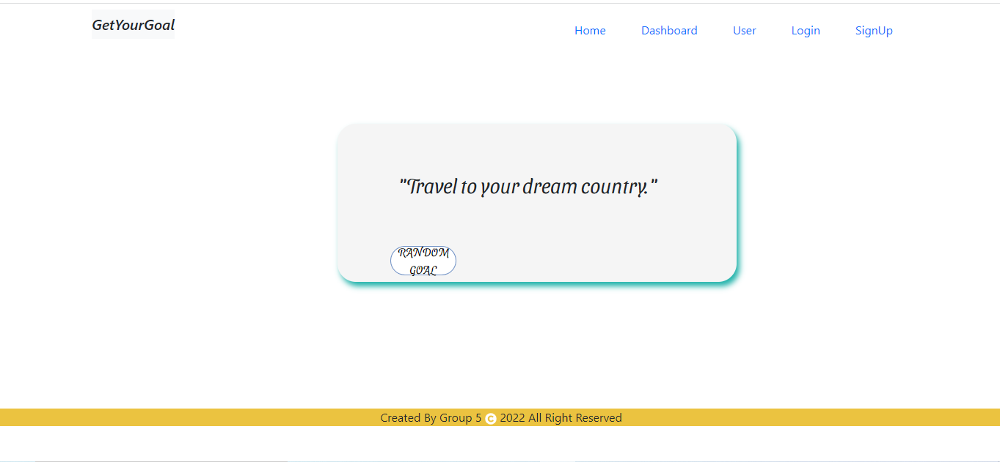
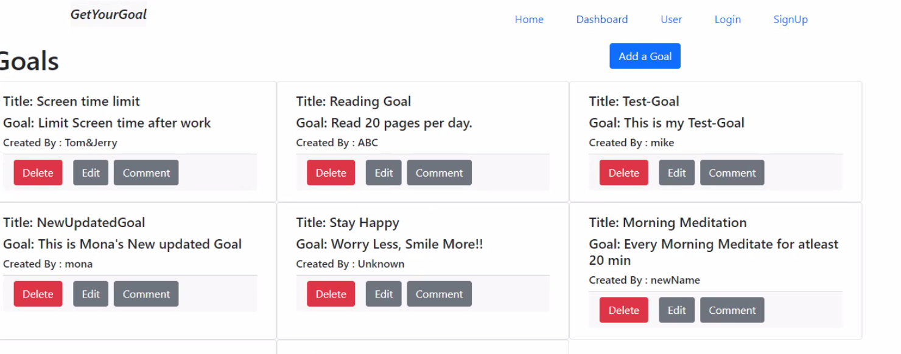

# get-your-goal-back-end

## Task

We build a Spring Boot Java back-end get-your-goal-back-end, where user can create their goals and comment on other users’ goals. Here we build this app 
completely from scratch. In this app we used following 
Java based technologies, Spring Boot Initializer, Spring Web, Spring Data Jpa, MySQL Driver, Eureka service registry,Validation I/O and Swagger Open UI.

## User Story

```md
AS A user I can create goal
I WANT to edit and delete goal when achieved
SO THAT I can have track on my goal
I can register from app
So that I can use it
```
## Description


 ```md
GIVEN a GetYourGoal App back-end
WHEN I wanted to visit the site for the first time
THEN I have to use it's front end for better view
WHEN to check functionality of back-end
THEN by using getyourgoal.yaml file in Swagger Open UI I can check end points
WHEN user wants to register for app 
THEN user can create, update, retrieve and delete user details
WHEN user wants to CRUD for goal
THEN user can CRUD operation with goal and comment as well
```

## Mock-Up

The following image demonstrates the application functionality:





## Table Of Contents

- [Installation](#installation)
- [Usage](#usage)
- [Test](#test)
- [License](#license)
- [Contribution](#contribution)
- [Contact](#contact)
- [Questions](#questions)

## Installation

The following necessary technologies must be installed to run the application.

Java, Spring Boot, Spring Data Jpa, MySQL Driver, Spring Web, Eureka server, jUnit

## Usage

Application can be Run in IntelliJ IDEA or you can use the deployed to heroku link.

## Test

TDD, Mock MVC for Controller and Integration for Repositories

## License

This project is licensed under :

[MIT](https://opensource.org/licenses/MIT)

For more information about the license, check the above link.

## Contribution

Bindu Vaghela, Dereje Ayele

## Contact

* GitHub :[bindi-v](https://github.com/bindi-v)
          
          [dereatom](https://github.com/dereatom)

* Email : bindi.vaghela@gmail.com 


## Questions

If you have any questions, please reach out to our Github.

### Deployed Link

* [The URL of the GitHub repository](https://github.com/bindi-v/tech-news-java-api)

#### Thank you for visiting my Github!
